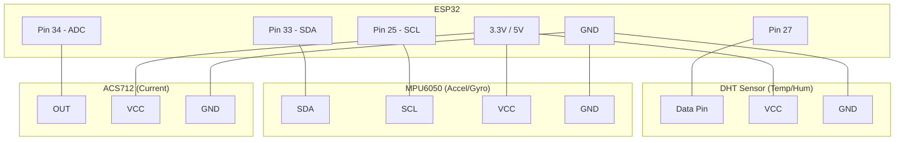

# ESP32 Firmware Requirements

To compile and run `mpu_test.ino`, you need to install the following libraries in your Arduino IDE:

### Required Libraries
1. **ArduinoJson** (by Benoit Blanchon) - Used for parsing and generating JSON payloads.
2. **DHT sensor library** (by Adafruit) - Used for reading DHT11/DHT22 sensors.
3. **Adafruit Unified Sensor** (by Adafruit) - A dependency for the DHT sensor library.
4. **MPU6050_light** (by rbguchhait) - A lightweight library for the MPU6050 accelerometer/gyroscope.

### Installation Instructions
1. Open the Arduino IDE.
2. Go to **Sketch** -> **Include Library** -> **Manage Libraries...**
3. In the search bar, type the name of each library listed above.
4. Select the correct library and click **Install**.

### Circuit Diagram (Logical Connections)

### Pin Connection Table

| Sensor | Sensor Pin | ESP32 Pin | Note |
| :--- | :--- | :--- | :--- |
| **DHT22** | VCC | 3.3V / 5V | Depends on sensor module |
| | GND | GND | |
| | Data | **Pin 27** | |
| **MPU6050**| VCC | 3.3V | |
| | GND | GND | |
| | SDA | **Pin 33** | I2C Data |
| | SCL | **Pin 25** | I2C Clock |
| **ACS712** | VCC | 5V | ACS712 usually requires 5V |
| | GND | GND | |
| | OUT | **Pin 34** | Analog Input (ADC1) |

### Hardware Setup
- **ESP32 Board**: Ensure you have the ESP32 board support installed (via Boards Manager: `https://raw.githubusercontent.com/espressif/arduino-esp32/gh-pages/package_esp32_index.json`).
- **Pins**: 
  - DHT: Pin 27
  - MPU6050: SDA (33), SCL (25)
  - ACS712: Pin 34
